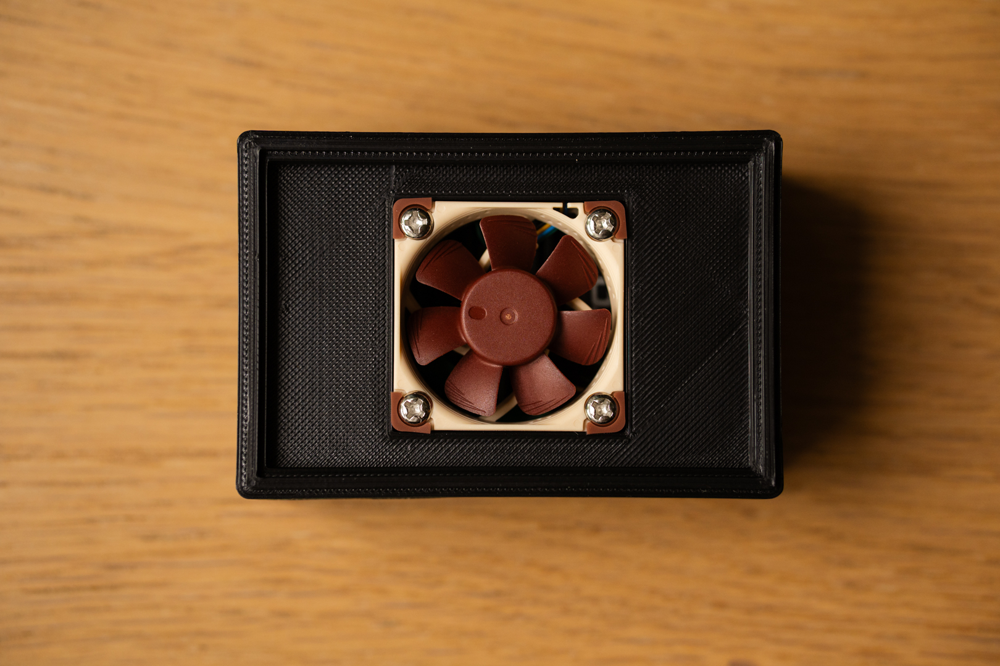

# RaspberryPi5_Active_Colling_Case
An active colling case for your RaspberryPi5 with EDATEC Heatsink and Noctua Fan.

You need:
1. NF-A4x10 5V PWM: https://www.noctua.at/en/products/nf-a4x10-5v-pwm
2. ED-Pi4Case-OB: https://edatec.cn/ac/Pi4Case_OB
3. M4 Screws: https://www.amazon.de/dp/B0B3CSQW4Y or you can 3D print one
4. JST SH 4-pin (Also known under Qwiic Connector) -> To any other Cable, we will solder it later
5. 3D printer or you can order it by a print company
6. Soldering iron for cables of the fan
7. Isolating tape or shrink tubes
