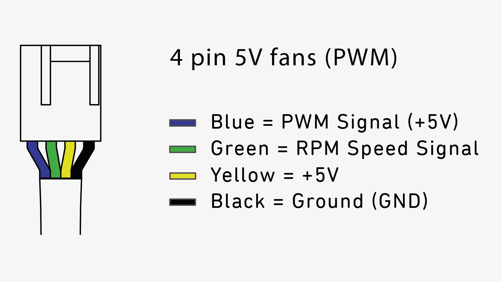

# RaspberryPi5_Active_Cooling_Case
An active cooling case for your RaspberryPi5 with EDATEC Heatsink and Noctua Fan.

## You need!
1. NF-A4x10 5V PWM: https://www.noctua.at/en/products/nf-a4x10-5v-pwm
2. ED_Pi5Case_O: https://edatec.cn/ac/ED_Pi5Case_O
3. M4 Screws: https://www.amazon.de/dp/B0B3CSQW4Y or you can 3D print one
4. JST SH 4-pin (Also known under Qwiic Connector) -> To any other Cable, we will solder it later
5. 3D printer or you can order it by a print company
6. Soldering iron for cables of the fan
7. Isolating tape or shrink tubes
#### Total Costs: 30€ - 50€

## Settings for 3D print
1. You should change your settings to your specific printer and material,  
but in fact there are some settings you need, especially for the supports.  
2. The 3D models are printed with the groove facing to the bottom,  
in general you doesn't need to change the orientation.  
<table>
  <tr>
    <td></td>
    <td></td>
  </tr>
</table>

### Support
Change everthing in **Support** to standard and add the settings below. 
**Support Structure** -> **Normal**  
**Support Placement** -> **Everywhere**  
**Support Overhang Angle** -> **55.0°**  
**Support Pattern** -> **Zig Zag**  
**Support Density** -> **10%**  
**Minimum Support Area** -> **40mm** -> Provides supports in large areas without the supports in the hexagons.

### Other settings you can copy if you want
**Quality** Layer Height <= 0.2mm  
**Walls** -> ZSeam Position should be placed  
**Infill** Infill Density >= 10%  
**Infill** Infill Pattern -> Lines  
**Build Plate Adhesion** -> Brim  
**Brim Width** -> 8mm  
 
## Connect the fan wires to the Raspberry Pi 5
To connect the fan wires we use the already existing jst header that is located on the board.  
Depending on the color of your cabels on your **JST SH** adapter you need to solder it together. 
 
Solder the wires according to the diagram provided below: 
<table>
  <tr>
    <td></td>
    <td></td>
  </tr>
</table>

## Guide for correct cabel connection
1. Cut the wire of the fan to 7 cm
2. Strip the big insulation 2cm and from that the small insulation of the 4 wires to 1cm
3. Strip the wire of the JST-SH connector to 5cm and from that the small insulation of the 4 wires to 1cm
4. Twist and solder the wires like shown in the pictures
5. Insulate the cabels with the technic I show in the pictures
<table>
  <tr>
    <td></td>
    <td></td>
  </tr>
</table>
<table>
  <tr>
    <td></td>
    <td></td>
    <td></td>
    <td></td>
  </tr>
</table>
 

## Programm the temperatur freshholds and speeds of the fan:
1. The raspberry pi should already have a running OS and we programm via the powershell
2. Go into the config.txt file on your Raspberry Pi5: sudo nano /boot/firmware/config.txt
3. Go to the bottom of the file and paste the code I provide under "[all]": Code -> Extention
4. Save the file and close it: Strg + O, Enter and Strg + X
5. Reboot the Pi and wait until you can log in again: sudo reboot
 

## Things I need to update in the future
#### ~~Explain the settings for 3D print espacially for the supports~~
#### ~~How to solder the fan wires and JST SH Connector correct together~~
#### How to mount everthing together in a few simple steps
#### ~~How to programm the fan settings on the pi via powershell~~
#### Tests on how effective is this really
